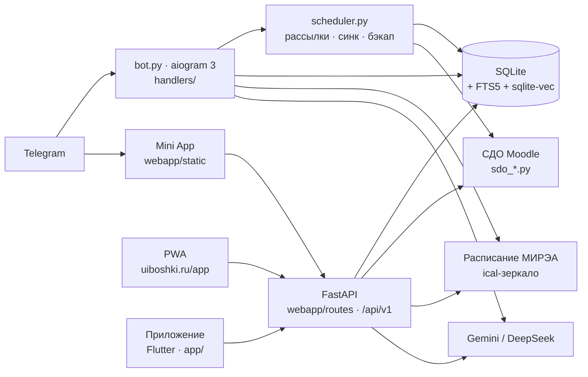

# УИБО-бот

[](https://github.com/mekit54567/uiboshki-bot/actions/workflows/ci.yml)


**Вся учёба — в Telegram, в браузере и в своём приложении.** Расписание всего
университета, баллы и сдача работ из СДО, дедлайны с напоминаниями, файлы
курсов с поиском внутри лекций и ИИ, который отвечает по лекциям группы и
показывает слайд, откуда взял ответ. Начинался как бот
[@UiboshkiBot](https://t.me/UiboshkiBot) группы УИБО-03-24, теперь — для любой
группы РТУ МИРЭА.

**[Сайт с живым демо](https://www.uiboshki.ru)** ·
**[Бот в Telegram](https://t.me/UiboshkiBot)** ·
**[Без Telegram — uiboshki.ru/app](https://www.uiboshki.ru/app)** ·
**[Канал о разработке](https://t.me/uiboshki_dev)**

<p align="center"><a href="https://www.uiboshki.ru">
</a></p>

> **In English.** A Telegram bot and Mini App for a university group
> (RTU MIREA, Moscow): schedule search across the whole university, grades
> and assignment submission scraped from Moodle, deadline reminders, course
> files with full-text and semantic search, and an AI assistant grounded in the
> group's own lecture slides (hybrid RAG: SQLite FTS5/BM25 + sqlite-vec,
> RRF + MMR, answers cite the exact slide). Works in Telegram, as an
> installable PWA with web push (uiboshki.ru/app, login via Telegram or VK ID)
> and as a native Flutter app for Android and iOS on the same versioned API.
> Python · aiogram 3 · FastAPI · SQLite · Gemini · Flutter. Solo project:
> ~20k lines of Python, ~6k of web frontend, ~10k of Dart, 770+ tests,
> CI on every PR, deployed on Railway.

<table>
<tr>
<td></td>
<td></td>
<td></td>
<td></td>
<td></td>
</tr>
<tr>
<td align="center">Главная</td><td align="center">Неделя + баллы</td><td align="center">СДО</td>
<td align="center">Дедлайны</td><td align="center">Уведомления</td>
</tr>
</table>

<sub>Скриншоты — на демо-данных: ничьих настоящих баллов и файлов.</sub>

## Где пользоваться

| | Как открыть | Что особенного |
|---|---|---|
| **Telegram** | [@UiboshkiBot](https://t.me/UiboshkiBot) → «Открыть приложение» | бот сам пишет про пары и сроки, inline-режим в любом чате |
| **Телефон без Telegram (PWA)** | [uiboshki.ru/app](https://www.uiboshki.ru/app) → iPhone: «Поделиться → На экран „Домой“», Android: «Установить приложение» | вход через Telegram или VK ID, уведомления пушем, расписание без сети |
| **Компьютер** | тот же адрес в Chrome, Edge или Яндекс Браузере → «Установить» | отдельное окно, как обычная программа |
| **Android и iPhone** | своё приложение «Капибара» на Flutter (`app/`) — сборки APK и IPA в [GitHub Actions](https://github.com/mekit54567/uiboshki-bot/actions/workflows/app-build.yml) | скоро в RuStore; пока — тестовые сборки |

Данные везде одни: что отметил в Telegram — видно в PWA и в приложении.

## Проект в цифрах

| | |
|---|---|
| Срок | апрель 2026 → сейчас, один разработчик |
| Код | ~20 тыс. строк Python, ~6 тыс. — фронтенд Mini App и PWA (без фреймворков и сборки), ~10 тыс. — приложение на Flutter |
| Платформы | Telegram (бот + Mini App), PWA с веб-пушами, Android и iOS (Flutter) — одно API `/api/v1` |
| Тесты | 770+ автотестов бэкенда и фронта, 50+ тестов приложения, CI (GitHub Actions) на каждый pull request |
| История | 470+ коммитов, 150 pull request'ов, 280+ версий в [CHANGELOG](CHANGELOG.md) |
| Данные | ~600 файлов курсов, у 535 — текст для поиска и ИИ |

## Что умеет

**📅 Расписание**
- главная: следующая пара с обратным отсчётом, пары на сегодня, погода;
  плашка «сегодня пары на МП-1, а не на В-78», если корпус не свой;
- неделя по дням: у каждой пары — баллы по предмету из СДО, нажатие ведёт в
  её текущий контроль;
- поиск расписания любого преподавателя, группы или аудитории МИРЭА —
  работает даже с VPN; подписка на него в календаре телефона;
- сайт МИРЭА лежит — бот показывает сохранённую копию с пометкой времени.

**🎓 СДО (Moodle) — своим входом**
- баллы БРС по каждому предмету: категории, пороги, график роста;
- цель по предмету: выбрал зачёт или «3/4/5» — сколько не хватает, откуда
  взять и хватает ли зачтённых работ (правило 75 %);
- посещения лекций — восстановлены из баллов за посещаемость;
- сдача работ прямо из Telegram: бот заранее показывает, какие файлы примет
  задание; сдал — дедлайн отмечается сам;
- бот пишет сам: изменились баллы, появилось новое задание, перенесли срок.

**📂 Файлы и лекции**
- сотни файлов курсов, разложенные по предметам и типам (лекции, практики,
  КР, методички), понятные названия вместо «ЛК3_бизнес_финал.pdf»;
- **поиск внутри лекций**: «дисконтирование» → «Лекция 5 · слайд 12» и
  отрывок, нажал — открылась страница;
- конспект любой лекции одной кнопкой — один на всю группу;
- «скинь практику 3 по ООП» прямо в чате.

**✨ ИИ по лекциям группы**
- чат и решалка отвечают по материалам группы, а не «вообще»: под ответом —
  ссылки на слайды, откуда взята информация;
- фото задачи → решение с объяснением; математика читаемая (x², √, ≤);
- знает расписание и дедлайны: на «что сдавать на неделе?» отвечает по делу.

**🔔 Уведомления — под себя**
- утро: пары, погода, другой корпус; выбор дней, «только если есть пары»;
- перед парой — три сценария (первая пара, после короткой перемены, после
  большого перерыва); дедлайны; воскресный обзор недели с ростом баллов.

**💬 В любом чате** — inline-режим: `@UiboshkiBot` → картинка с расписанием.

**🌐 Сайт** — живое приложение на выдуманных данных, поиск расписания МИРЭА
без входа, светлая и тёмная тема.

**📱 Без Telegram** — [uiboshki.ru/app](https://www.uiboshki.ru/app): то же
приложение ставится на экран телефона или компьютера (PWA), вход через бота или
VK ID, уведомления — веб-пушем, последнее открытое — без сети. Своё приложение
«Капибара» для Android и iPhone на Flutter — на том же API.

**👑 Для старосты** — рассылки, статистика (`/stats`), состояние бота
(`/status`), тревога при всплеске ошибок, посты канала, ночной бэкап базы.

## Инженерные задачи, которые пришлось решить

**Расписание, когда API недоступен.** Официальный поиск МИРЭА не отвечает
серверу за рубежом, а у зеркала поиска нет вовсе. Бот сам собирает
справочник: перебирает id календарей и с каждого читает только первый
килобайт (HTTP `Range`) — там название группы или преподавателя. Тысячи
групп, преподавателей и аудиторий, обновление раз в месяц, поиск — обычный
SQL по своей базе.

**Moodle без API.** Дедлайны — через внутренний AJAX календаря, баллы —
разбор журнала оценок, сдача работ — та же цепочка запросов, что у браузера
(черновая область → загрузка → сохранение → «отправить на проверку»). Типы
файлов задания берутся из настроек файлового менеджера, а не из первого
попавшегося списка: у редактора текста на той же странице свой список
(картинки), и на нём бот однажды споткнулся.

**ИИ, который отвечает по лекциям (RAG).** Лекции режутся по слайдам и
страницам, индекс — SQLite: FTS5/BM25 по словам и векторы Gemini в
`sqlite-vec` по смыслу. Два списка сливаются через Reciprocal Rank Fusion,
MMR убирает повторы, ИИ получает куски с номерами и ссылается на них — под
ответом «Лекция 5 · слайд 12», а страница PDF рисуется на сервере.

**Посещаемость без доступа к журналу посещений.** Пульс университета не
пускает сервер, поэтому посещения восстанавливаются из баллов: баллы за
посещаемость делятся поровну на лекции семестра, бот решает, сколько
посещено и сколько отработок, а по ежедневной истории баллов видно, какие
именно лекции засчитаны.

**Безопасность.** Вход в Mini App — по подписи Telegram `initData` (HMAC),
входы студентов в СДО зашифрованы (Fernet, ключ отдельно от базы), ссылки на
файлы подписаны и живут 10 минут, лимиты частоты по настоящему IP (самый
правый публичный адрес `X-Forwarded-For` — первый подставляет посетитель),
ограничение размера запросов, заголовки безопасности.

**Надёжность на бесплатных лимитах.** Кэш и «одна загрузка на всех» для
календарей, запасная копия расписания, запасные модели ИИ при исчерпанном
лимите, дневной лимит вопросов на человека (выключатель), тревога старосте
при всплеске ошибок, ночной бэкап базы с восстановлением одной командой.

## Как устроено



Бот и Mini App — один процесс и одна база (Railway). Фронтенд — обычные
скрипты без сборки; авторизация — по `initData` Telegram, вне Telegram —
токен сессии устройства (вход через бота, VK ID или Яндекс ID). PWA и своё
приложение ходят в версионированное API `/api/v1` (снимок контракта в тестах).

| Слой | Что используется |
|---|---|
| Бот | aiogram 3, APScheduler, inline-режим, Mini App кнопкой меню |
| Бэкенд | FastAPI + uvicorn в процессе бота, aiosqlite |
| Поиск | SQLite FTS5 (BM25), sqlite-vec, эмбеддинги Gemini, RRF + MMR |
| Данные | httpx, BeautifulSoup (Moodle), icalendar, pypdf / python-pptx / python-docx, pypdfium2 |
| Картинки | Pillow — карточки расписания, статистика, обложки постов |
| Вне Telegram | PWA (service worker, веб-пуши RFC 8291 + VAPID без внешних библиотек), OAuth VK ID и Яндекс ID |
| Приложение | Flutter (Android и iOS), общие дизайн-токены с вебом, сборки APK/IPA в GitHub Actions |
| Качество | pytest (770+), ruff, flutter test, GitHub Actions, дымовой тест Mini App в Chromium |

Подробно для разработки — [CLAUDE.md](CLAUDE.md), история версий —
[CHANGELOG.md](CHANGELOG.md), план — [PLAN.md](PLAN.md).

## Как ведётся разработка

- каждое изменение — отдельная ветка и pull request, CI зелёный до мержа;
- на каждый найденный баг — тест, который его ловит;
- у каждого коммита своя версия в [CHANGELOG](CHANGELOG.md) (`эпоха.фича.фикс`)
  с кодовым именем;
- большие выпуски проходят ревью кода, найденное чинится тем же PR;
- о том, как и почему делается бот, — [канал @uiboshki_dev](https://t.me/uiboshki_dev).

## Запуск

```bash
pip install -r requirements.txt
python bot.py          # бот; с WEBAPP_URL — и Mini App в том же процессе (порт PORT, по умолчанию 8080)
```

Главные переменные окружения (полный список — `config.py`):

| Переменная | Зачем |
|---|---|
| `BOT_TOKEN` | токен бота (обязателен) |
| `STAROSTA_ID` | Telegram ID старосты, можно несколько через запятую |
| `WEBAPP_URL` | адрес Mini App (кнопки «Открыть приложение», сайт) |
| `GEMINI_API_KEY`, `DEEPSEEK_API_KEY` | ИИ; DeepSeek необязателен (запасной) |
| `GEMINI_FALLBACK_MODELS`, `AI_DAILY_LIMIT` | запасные модели при лимите; вопросов к ИИ в сутки на человека (0 — без лимита) |
| `SDO_SESSION_COOKIE` | вход старосты в СДО (дедлайны и файлы курсов) |
| `SDO_CRYPT_PASSPHRASE` | секретная фраза — ключ шифрования входов студентов |
| `ICAL_URL`, `GROUP_NAME`, `BOT_USERNAME`, `GROUP_PROGRAM` | своя группа (по умолчанию — УИБО-03-24) |
| `CHANNEL_URL`, `CONTACT_URL` | ссылки плиток «Канал бота» и «Написать нам» в Mini App |
| `DATABASE_PATH` | где лежит SQLite |

## Тесты

```bash
pip install -r requirements-dev.txt
pytest          # 700+ тестов, без сети
ruff check .    # линтер
```

Тесты реальные, не заглушки: настоящая SQLite (временный файл на каждый
тест), настоящий роутинг aiogram через `Dispatcher.feed_update` (так однажды
поймали баг с порядком регистрации, который прямые вызовы хендлеров не
видели), настоящая HMAC-проверка подписи Telegram, фронт — через
`node --check` и отрисовку в Chromium. В сеть наружу (Telegram, Gemini, СДО,
МИРЭА) тесты не ходят: такие вызовы подменяются точечно.

Тестами **не** покрыто: живые походы в Gemini и СДО (проверяются вручную на
живом боте) и сами таймеры APScheduler (тестируются функции, которые они
вызывают).

## Мониторинг

`GET /health` — для внешнего аптайм-чекера; `/status` у старосты — синк СДО,
кука, бэкап, индекс поиска, ИИ и ошибки за сутки; при всплеске ошибок бот
пишет старосте сам.

## Автор

Никита — староста УИБО-03-24, РТУ МИРЭА · Telegram [@Partykq](https://t.me/Partykq)

---

Разработка велась с использованием Claude.
